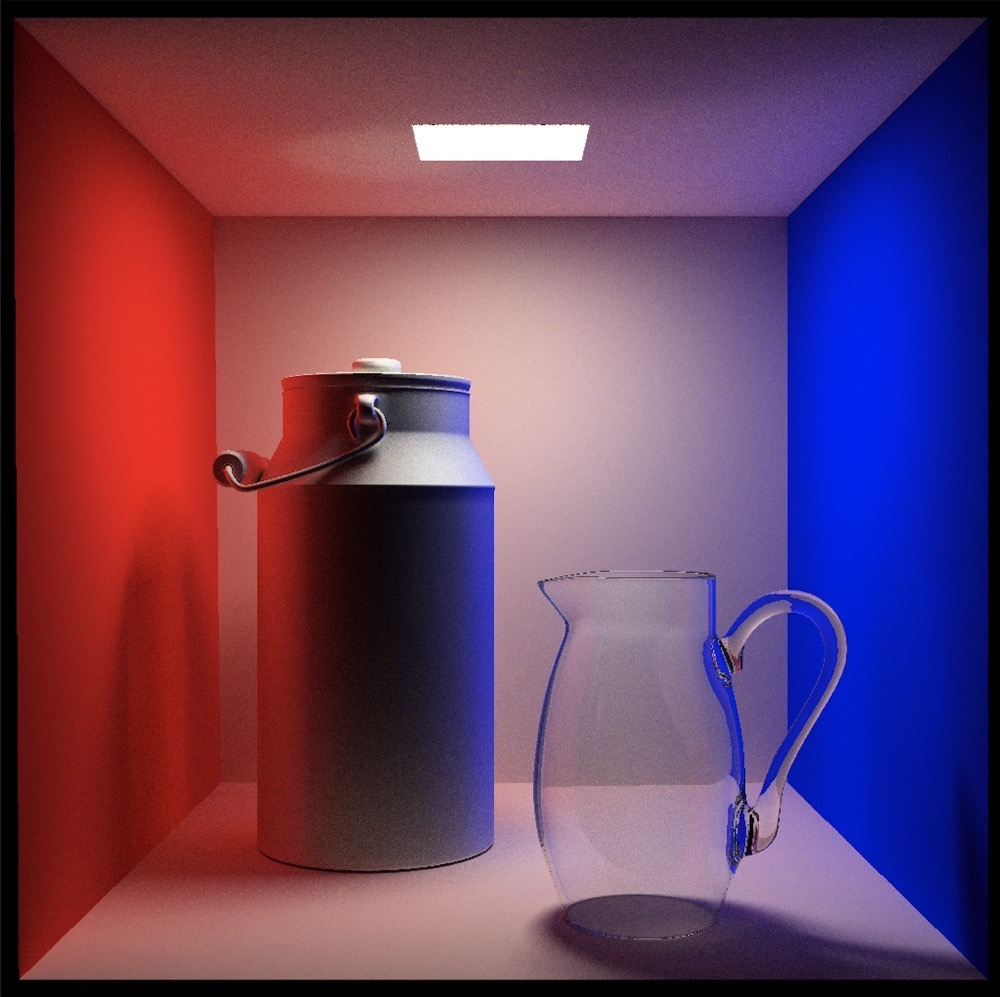
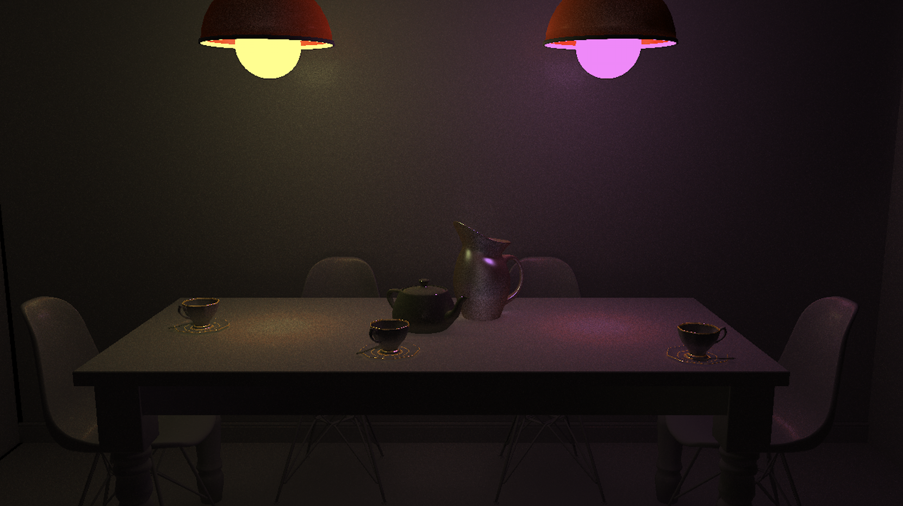
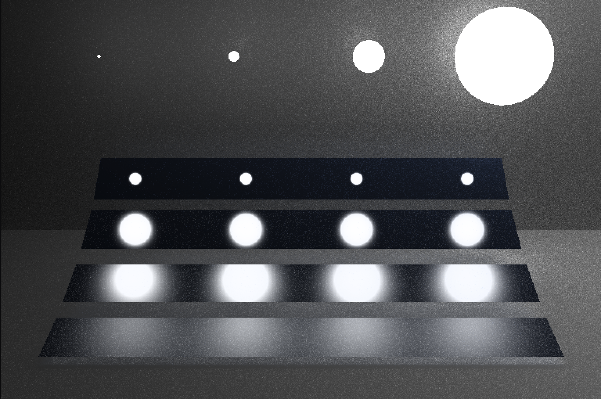
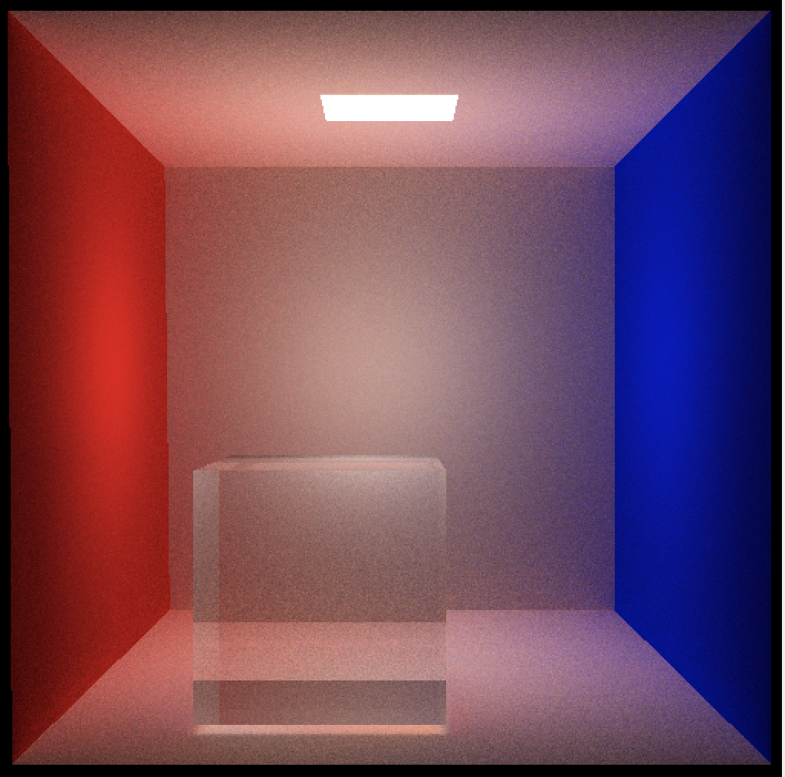

# An experimental path tracing implemention
# 1. Intro
This program mainly focuses on a **physical-based rendering** technique, namely path tracing as a coursework.Most of ideas coming from the awesome [pbrt-book](http://www.pbr-book.org/), such as the concept of BRDF/BSDF, lights sampling, Russian Rouslette and so on. 

It's very handy to use. You can get a result simply by typing after building:
```
./PathTracer ./config/cbox.conf
```
and you will get the following revised Cornell-Box. :O

## 2. Dependencies
1. clang++
2. glfw/OpenGL/GLEW
5. jsoncpp
6. tinyobj: a header-only obj loader
7. OpenMP
8. CMake
## 3. How to build it?
This program is managed by CMake, has been fully tested on macOS Mojave, and is very easy to build :)
```
mkdir build/
cd build
cmake ..
make -j10
```

## 4. The structure
1. ./src/: source codes.
2. ./conf/: diversity scenario settings. Feel free to set up your own scenary and arbitary params as you want.
3. ./model/: all scene files are put into it.

## 5. Some Results(not perfect)
1. The Cornell Box:
2. The Dining Room:
3. The Veach Mis: 
4. My own basic scene: 